### Notes taking app

## Yeeee! This is the project we have completed in OOP by Java.
It's a note-taking app like Notion but simpler

  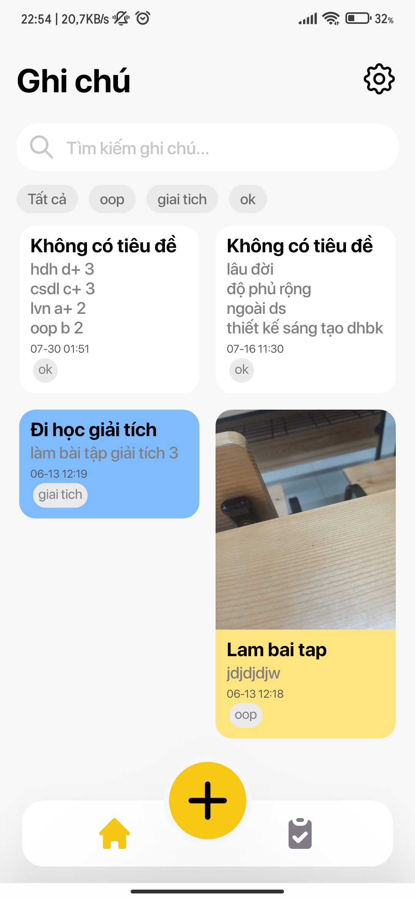
  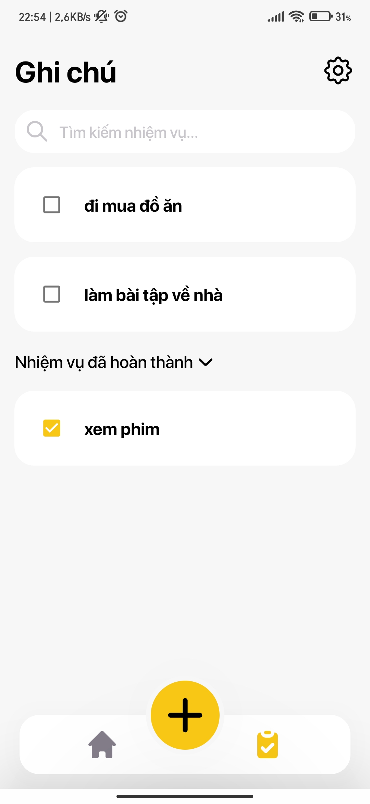

<h2>Getting Started</h2>
<ol>
  <li>Clone the repository:
    <pre><code>git clone https://github.com/DUYCUTEPHOMAIQUE/notes-taking-app.git</code></pre>
  </li>
  <li>Navigate to the project directory:
    <pre><code>cd notes-taking-app</code></pre>
  </li>
  <li>Set up the Firebase project and configure the app with your Firebase.</li>
  <li>Build and run the app on your Android device.</li>
</ol>

<h2>Features</h2>
<ul>
  <li style="display:flex; flex-direction: row">
   
<strong>Create Note and Task:</strong> Add, edit, and delete notes easily.

   

    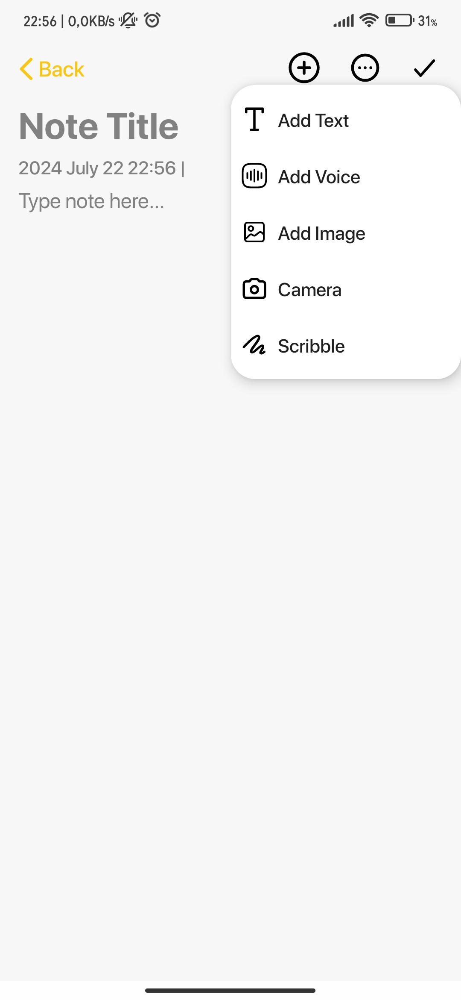
   

  </li>
  <li>
   
<strong>Note Lists, Task Lists with Reminders</strong> Create to-do lists and set reminders to stay on top of your tasks. 

   

    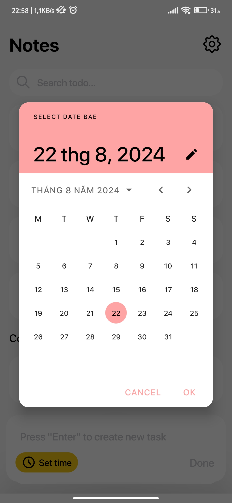
    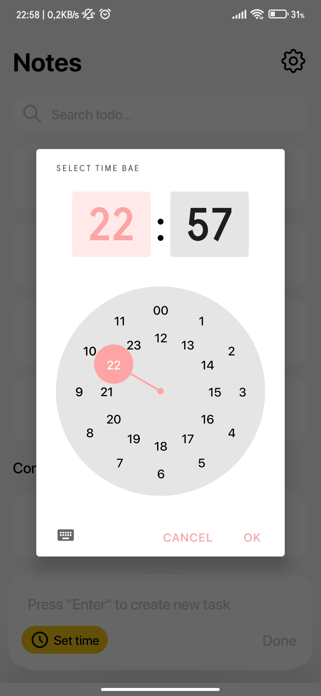
   

  </li>
  <li><strong>Rich Media Support:</strong> Attach images, audio recordings, and sketches to your notes for a more comprehensive record.
   

    
    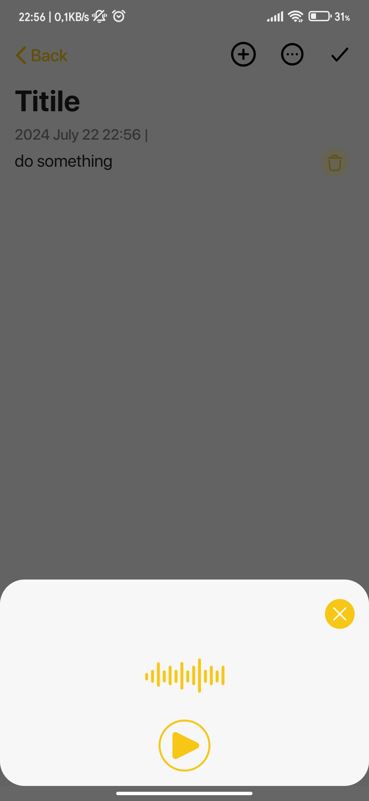
    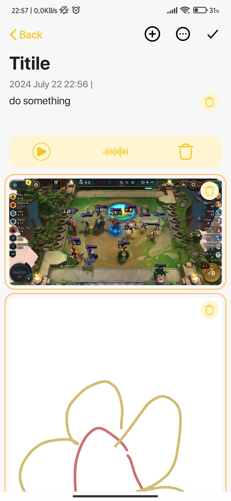
    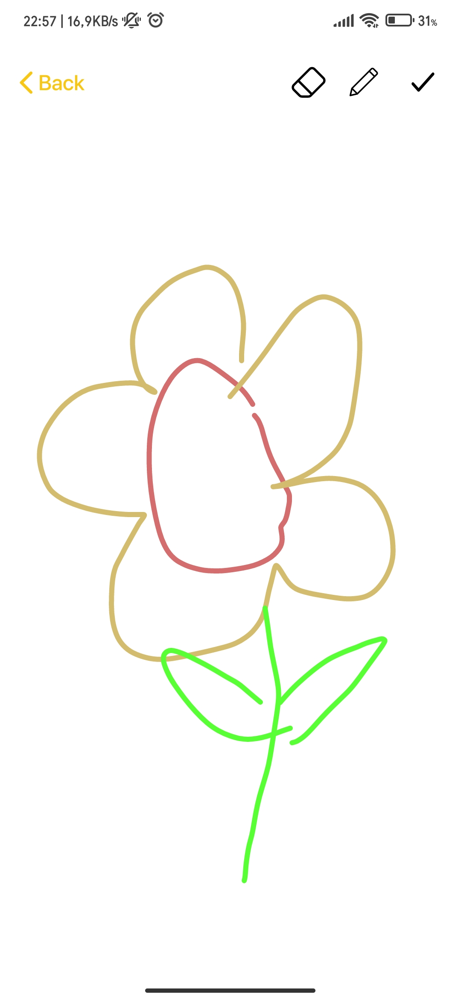
   

  </li>
  <li><strong>Dark Mode:</strong> Toggle between light and dark themes for a comfortable user experience in any lighting condition.
  

    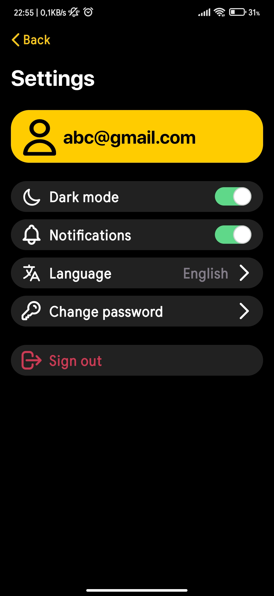
    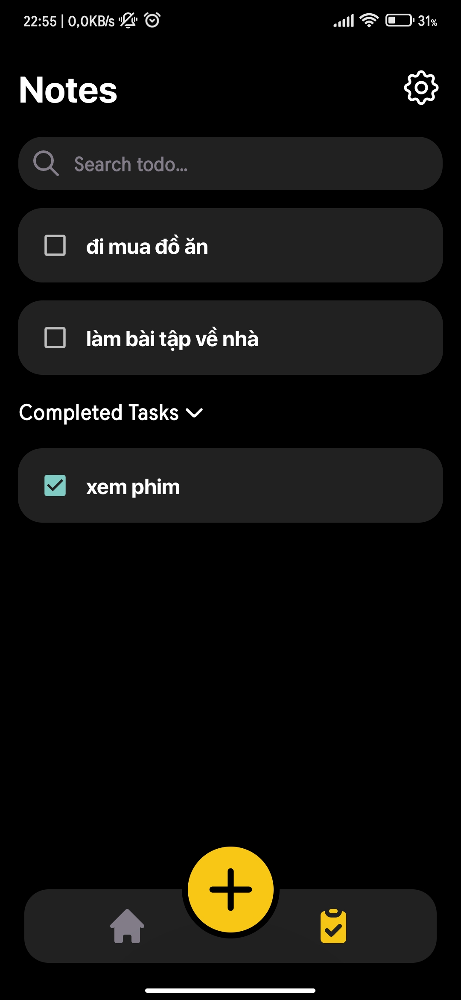
    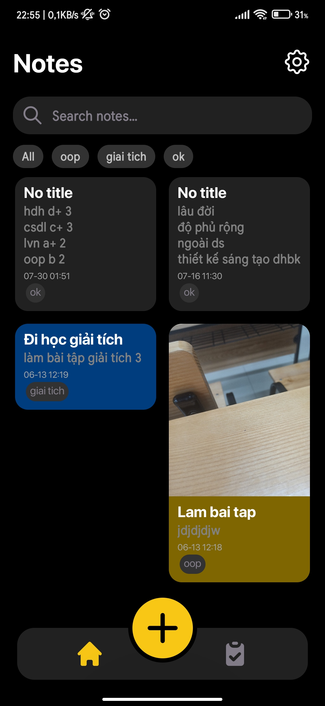
   

  </li>
  <li><strong>Cloud Sync:</strong> Your data will sync on Firebase Storage if u logout from app</li>
</ul>
